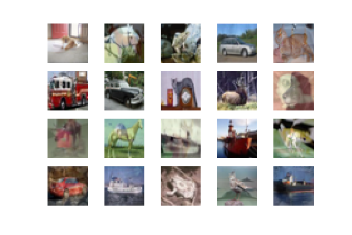
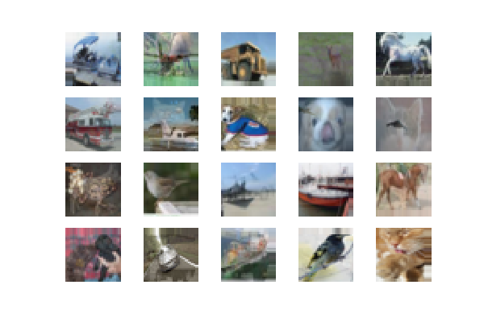
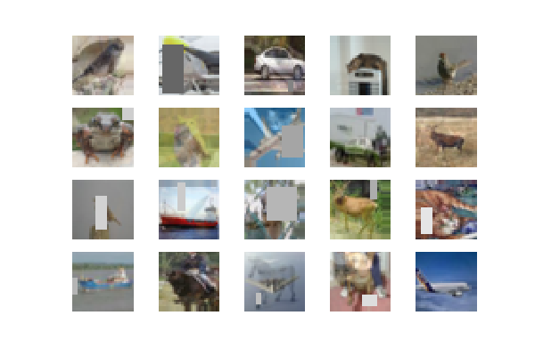

# mixup generator
This is an implementation of the mixup algorithm.



## Mixup
Mixup [1] is a kind of image augmentation methods,
which augments training data by *mixing-up* both of training images and labels
by linear interpolation with weight `lambda`:

```
X = lambda * X1 + (1 - lambda) * X2,
y = lambda * y1 + (1 - lambda) * y2,
```

where `lambda` is drawn from the Beta distribution `Be(alpha, alpha)`,
and `alpha` is a hyperparameter.

Please check [mixup_generator.py](mixup_generator.py) for implementation details.


## Usage
Get `MixupGenerator`:

```python
from mixup_generator import MixupGenerator
training_generator = MixupGenerator(x_train, y_train, batch_size=batch_size, alpha=0.2)()
```

- `x_train` : training images (#images x h x w x c)
- `y_train` : labels as one hot vectors (#images x #classes or list of #images x #classes for multi-task training)
- `batch_size` : batch size
- `alpha` : hyper parameter; `lambda` is drawn from the beta distribution `Be(alpha, alpha)`.

Get *mixed* training batch:

```python
x, y = next(generator)
```

Please refer to [test_mixup.ipynb](test_mixup.ipynb) to see how it works.


### Use MixupGenerator with fit_generator in Keras
It is very easy to use `MixupGenerator` in training if you are using Keras;
Get `MixupGenerator`, and then fit model by `fit_generator`:

```python
model.fit_generator(generator=training_generator,
                    steps_per_epoch=x_train.shape[0] // batch_size,
                    validation_data=(x_test, y_test),
                    epochs=epochs, verbose=1,
                    callbacks=callbacks)
```

Please refer to [cifar10_resnet.py](cifar10_resnet.py) for complete example,
which is imported from [official Keras examples](https://github.com/fchollet/keras/tree/master/examples).

### MixupGenerator with ImageDataGenerator
The `MixupGenerator` can be combined with
`keras.preprocessing.image.ImageDataGenerator` for further image augmentation:

```python
datagen = ImageDataGenerator(
    width_shift_range=0.1,
    height_shift_range=0.1,
    horizontal_flip=True)
    
training_generator = MixupGenerator(x_train, y_train, batch_size=batch_size, alpha=0.2, datagen=datagen)()
```

In this case, the *mixed-up* training images are further augmented by ImageDataGenerator.



### Mixup with Random Erasing
Random Erasing [2] is a kind of image augmentation methods for convolutional neural networks (CNN).
It tries to regularize models using training images that are randomly masked with random values.

Please refer to [this repository](https://github.com/yu4u/cutout-random-erasing)
for the details of algorithm and its implementation.

Mixup can be combined with Random Erasing via ImageDataGenerator by:

```python
from random_eraser import get_random_eraser

datagen = ImageDataGenerator(
    width_shift_range=0.1,
    height_shift_range=0.1,
    horizontal_flip=True,
    preprocessing_function=get_random_eraser(v_l=0, v_h=255))

generator = MixupGenerator(x_train, y_train, alpha=1.0, datagen=datagen)()
```

The augmented images become like this:




## Results
(!Only a single trial)

Without mixup:

```
Test loss: 0.862150103855
Test accuracy: 0.8978
```

With mixup alpha = 0.2:

```
Test loss: 0.510702615929
Test accuracy: 0.9117
```

With mixup alpha = 0.5:

```
Test loss: 0.48489781661
Test accuracy: 0.9181
```

With mixup alpha = 1.0:

```
Test loss: 0.493033925915
Test accuracy: 0.9167
```

## References
[1] H. Zhang, M. Cisse, Y. N. Dauphin, and D. Lopez-Paz, "mixup: Beyond Empirical Risk Minimization," in arXiv:1710.09412, 2017.

[2] Z. Zhong, L. Zheng, G. Kang, S. Li, and Y. Yang, "Random Erasing Data Augmentation," in arXiv:1708.04896, 2017.
